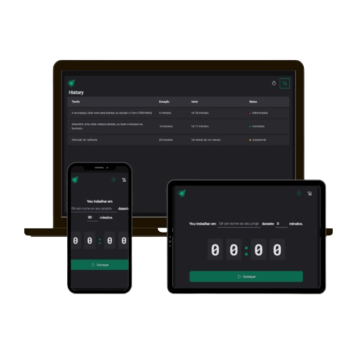

# Timer

Esta aplicação é uma ferramenta de produtividade inspirada na técnica Pomodoro, projetada para ajudar usuários a focarem em objetivos específicos e gerenciarem seu tempo de trabalho de forma eficaz. Com uma interface intuitiva e responsiva, com recursos que promovem a concentração, a aplicação visa aumentar a eficiência e a satisfação no alcance de metas pessoais e profissionais.

# Funcionalidades

**Configuração de Objetivo:** Antes de iniciar um ciclo Pomodoro, os usuários podem definir um objetivo específico para o período de foco. Isso ajuda a manter a clareza do propósito e a motivação ao longo do tempo de trabalho.

**Personalização do Tempo:** Os usuários têm a liberdade de ajustar o tempo de cada sessão de foco, com a possibilidade de definir ciclos de até 60 minutos, permitindo flexibilidade para diferentes tipos de tarefas e intensidades de trabalho.

**Início do Timer:** Com as configurações de objetivo e tempo definidas, o botão para iniciar o cronômetro é liberado. O timer começa a contagem regressiva, mantendo o usuário informado sobre o tempo restante de foco.

**Histórico de Sessões:** Cada sessão é salva automaticamente no armazenamento local do dispositivo (localStorage), criando um histórico persistente de todas as sessões de foco que o usuário realizou, incluindo detalhes como duração e objetivo.

**Status de Produtividade:** A aplicação acompanha o status de cada objetivo, que pode ser marcado como 'Interronpido', 'Concluído' ou 'Em Andamento'. Isso fornece ao usuário uma visão clara do progresso em seus objetivos e uma análise de sua produtividade ao longo do tempo.

**Interface do Usuário Amigável:** Projetada para ser simples e intuitiva, a aplicação reduz as distrações e permite que o usuário se concentre totalmente na tarefa em mãos.

**Adaptável a Diferentes Dispositivos:** Responsiva e acessível em diferentes dispositivos, permitindo que os usuários gerenciem seu tempo efetivamente, seja em casa, no trabalho ou em trânsito.

## [Veja você mesmo! Clique aqui - Timer](https://timer-lemon-chi.vercel.app/).

## Tecnologias Utilizadas

-   **React**: Uma biblioteca JavaScript para construção de interfaces de usuário.
-   **TypeScript**: Uma linguagem de programação de código aberto mantida pela Microsoft que é uma extensão de JavaScript.
-   **Styled Components**: Uma biblioteca para React e React Native que permite que você use estilos em seus componentes utilizando a sintaxe do CSS em JavaScript.

## Instalação

1. Clone o repositório: `git clone https://github.com/seu_usuario/seu_projeto.git`
2. Instale as dependências: `npm install` ou `yarn install`
3. Inicie o servidor de desenvolvimento: `npm start` ou `yarn start`

## Como Contribuir

1. Faça um fork do repositório
2. Crie uma branch para sua feature (`git checkout -b feature/MinhaFeature`)
3. Faça commit de suas alterações (`git commit -am 'Adicionei uma nova funcionalidade'`)
4. Faça push para a branch (`git push origin feature/MinhaFeature`)
5. Abra um Pull Request
